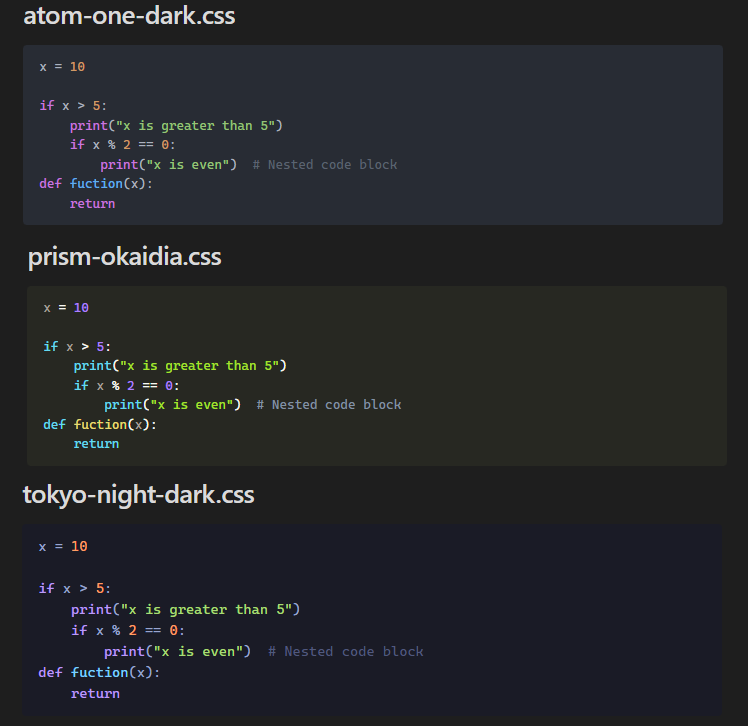

# Obsidian syntax highlighting

A collection of syntax highlighting snippets for Obsidian.

## What is syntax highlighting?

Syntax highlighting is a function that transforms code into a more intuitive visual language. Differentiating keywords, variables, and functions, among other elements with different colors, significantly improves the readability and comprehension of the code. This allows you to read the code faster and more fluently, quickly identify key elements, and better understand the structure and logic of the program.

## What are snippets?

Snippets are predefined code that you can use to modify the appearance of your Obsidian workspace.

## How to install the snippets

- Download: Download the snippets located in [snippets](/snippets). You can download the whole folder or the one you want to use.
- Place: Save the downloaded files in the vault > .obsidian > snippets folder.
- Enable: Open Obsidian, go to "Settings", then "Appearance" and at the bottom you will find "CSS snippets", where you can enable the snippet you want to use.

### Available snippets
- You can see screenshots of the available snippets [here](src/screenshots)

## Contributions

Your contributions are welcome! You can contribute by updating existing snippets or creating new ones. For more information, go to [CONTRIBUTING.md](CONTRIBUTING.md)
